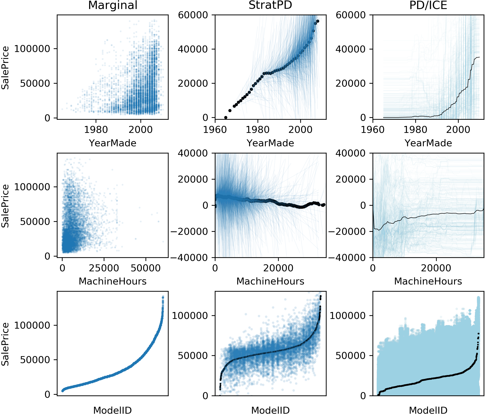
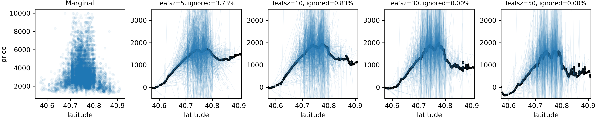
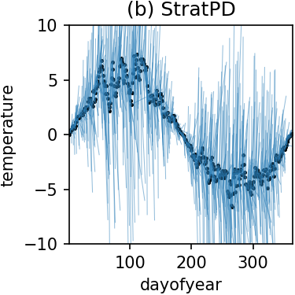
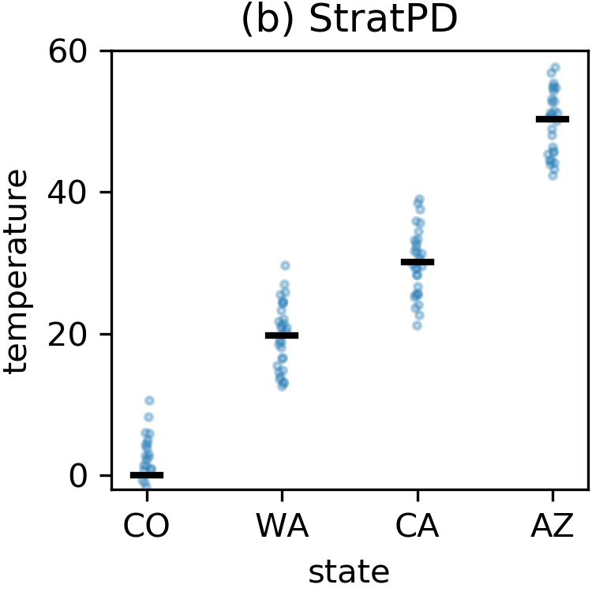
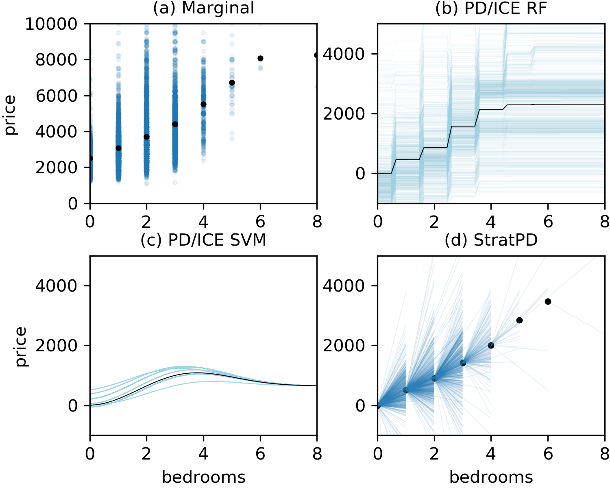
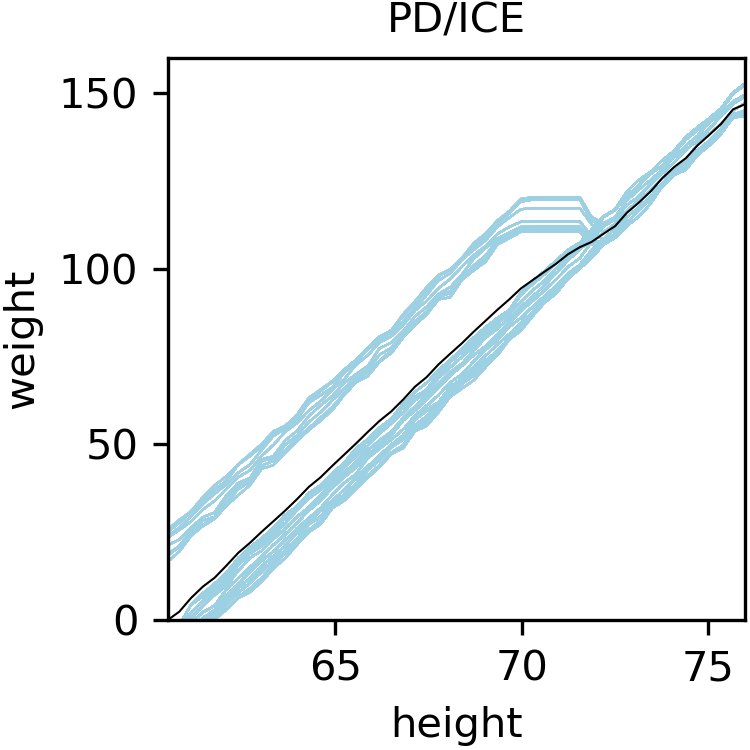
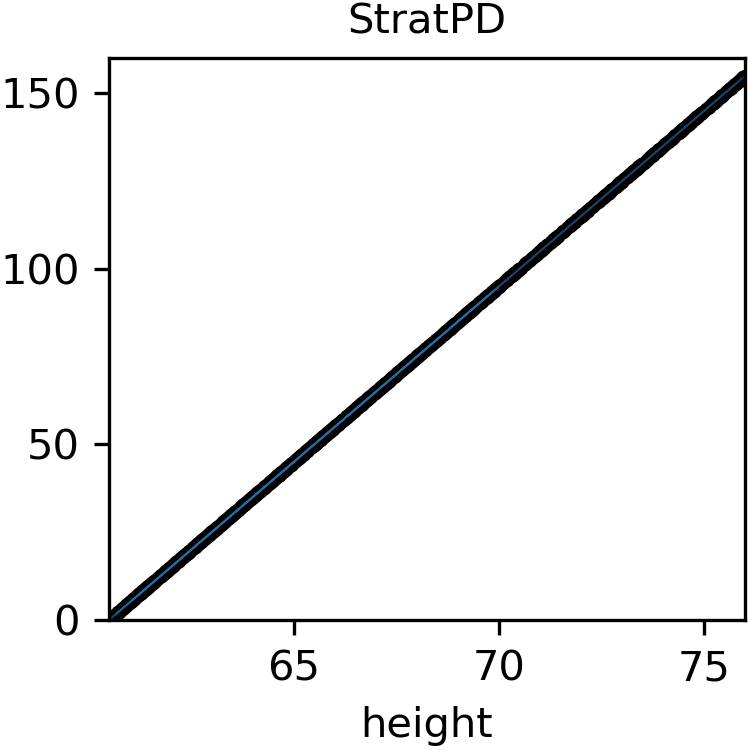

# A Stratification Approach to Partial Dependence for Codependent Variables

## Abstract 

This repo provides pip package `stratx` for the StratPD and CatStratPD algorithms for computing model-independent partial dependence. Source is Python 3 and MIT license.

Model interpretability is important to machine learning practitioners and a key component of  interpretation is the characterization of partial dependence of the response variable on any subset of features used in the model. The two most common strategies suffer from a number of critical weaknesses. In the first strategy, linear regression model coefficients describe how a unit change in an explanatory variable changes the response, while holding other variables constant. But, linear regression is inapplicable for high dimensional (p>n) data sets or when a linear model is insufficient to capture the relationship between explanatory variables and the response.  In the second strategy, Partial Dependence (PD) plots and Individual Conditional Expectation (ICE) plots give biased results for the common situation of codependent variables and they rely on fitted models provided by the user. When the supplied model is a poor choice due to systematic bias or overfitting, PD/ICE plots provide little (if any) useful information.

To address these issues, we introduce a new strategy, called StratPD, that does not depend on a user's fitted model, provides accurate results in the presence codependent variables, and is applicable to high dimensional settings. The strategy works by stratifying a data set into groups of observations that are similar, except in the variable of interest, through the use of a decision tree. Any fluctuations of the response variable within a group is likely due to the variable of interest. We apply StratPD to a collection of simulations and case studies to show that StratPD is a fast, reliable, and robust method for assessing partial dependence with clear advantages over state-of-the-art methods. 

## Examples

Kaggle [Blue book for bulldozer](https://www.kaggle.com/c/two-sigma-connect-rental-listing-inquiries) data set.

Kaggle [Two sigma connect: Rental listing inquiries.](https://www.kaggle.com/c/two-sigma-connect-rental-listing-inquiries) data set:

Using a synthetic weather data set where temperature varies in sinusoidal fashion over the year and with different baseline temperatures per state:

Here's an example of a categorical variable from the weather data set:

## Comparing to PDP / ICE plots

Plots of bedrooms versus rent price using New York City apartment rent data. (a) marginal plot, (b) PD/ICE plot derived from random forest, (c) PD/ICE plot derived from SVM, and (d) StratPD plot; sample size is 10,000 observations of ~400k. The PD/ICE plots are radically different for the same data set, depending on the chosen user model.

Plots of height versus weight using synthetic data body weight data (see academic paper). The PD/ICE on the left is biased by codependent features since pregnant women, who are typically shorter than men, have a jump in weight.

