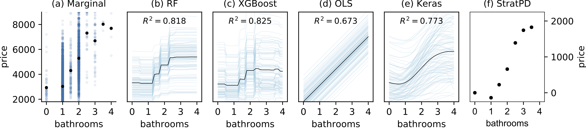
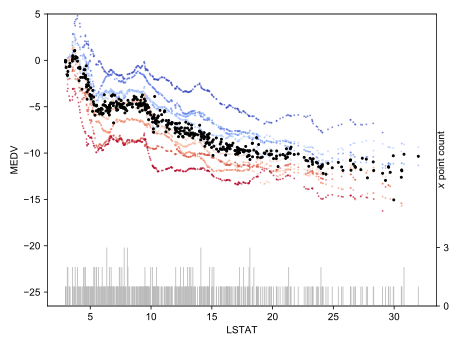
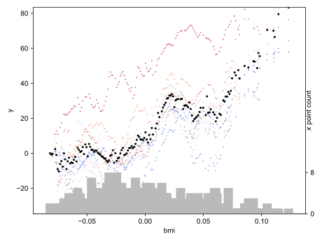
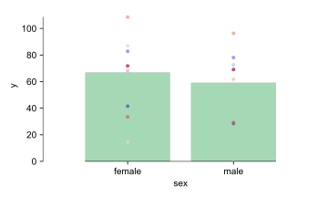
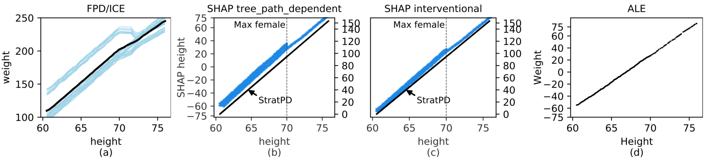

# Partial Dependence through Stratification

This repo provides pip package `stratx` for the StratPD and CatStratPD algorithms for computing model-independent partial dependence. Source is Python 3 and license is MIT.

## Abstract 

Partial dependence curves (FPD) introduced by Friedman (2000), are an important model interpretation tool, but are often not accessible to business analysts and scientists who typically lack the skills to choose, tune, and assess machine learning models. It is also common for the same partial dependence algorithm on the same data to give meaningfully different curves for different models, which calls into question their precision. Expertise is required to distinguish between model artifacts and true relationships in the data.

In this paper, we contribute methods for computing partial dependence curves, for both numerical (StratPD) and categorical explanatory variables (CatStratPD), that work directly from training data rather than predictions of a model. Our methods provide a direct estimate of partial dependence, and rely on approximating the partial derivative of an unknown regression function without first fitting a model and then approximating its partial derivative. We investigate settings where contemporary partial dependence methods—including FPD, ALE, and SHAP methods—give biased results. Furthermore, we demonstrate that our approach works correctly on synthetic and plausibly on real data sets. Our goal is not to argue that model-based techniques are not useful. Rather, we hope to open a new line of inquiry
into nonparametric partial dependence.

See the [academic paper](https://arxiv.org/abs/1907.06698) but  the basic problem is that the same algorithm, operating on the same data, can give meaningfully different partial dependences depending on the model chosen by the user.  Consider the following comparison of Friedman's partial dependence plots and ICE plots for 3 different models to the StratPD version.

<a href="images/bathrooms_vs_price.png"></a>

(Plots of bathrooms versus rent price using New York City apartment rent data. Sample size is 10,000 observations of ~50k. The PD/ICE plots are radically different for the same data set, depending on the chosen user model. Hyper parameters were tuned using 5-fold cross validation grid search over several hyper parameters. Keras model trained by experimentation: single hidden layer of 100 neurons, 500 epochs, batch size of 1000, batch normalization, and 30% dropout. StratPD gives a plausible roughly result that rent goes up linearly with the number of bathrooms. R2 were computed on 20% validation sets.)


## Installation

```bash
pip install stratx
```

## Examples

*See [notebooks/examples.ipynb](notebooks/examples.ipynb) for lots more stuff.*

### Boston

```python
from sklearn.datasets import load_boston
from stratx.partdep import *

boston = load_boston()
df = pd.DataFrame(boston.data, columns=boston.feature_names)
df['MEDV'] = boston.target

X = df.drop('MEDV', axis=1)
y = df['MEDV']

# WORKS ONLY WITH DATAFRAMES AT MOMENT
plt.figure(figsize=(3.5,3.5))
plot_stratpd(X, y, 'LSTAT', 'MEDV', yrange=(-20, 5), n_trials=10)
plt.tight_layout()
plt.show()
```

<a href="images/boston_LSTAT.svg"></a>

### Diabetes

```python
from sklearn.datasets import load_diabetes
from stratx.partdep import *

diabetes = load_diabetes()
df = pd.DataFrame(diabetes.data, columns=diabetes.feature_names)
df['y'] = diabetes.target
X = df.drop('y', axis=1)
y = df['y']
plt.figure(figsize=(3.5,3.5))
plot_stratpd(X, y, 'bmi', 'y', n_trials=10)
plt.tight_layout()
plt.show()
```

<a href="images/diabetes_bmi.svg"></a>

```python
diabetes = load_diabetes()
df = pd.DataFrame(diabetes.data, columns=diabetes.feature_names)
df['sex'] = np.where(df['sex']<0, 0, 1)
df['y'] = diabetes.target
X = df.drop('y', axis=1)
y = df['y']

plt.figure(figsize=(3.5,3.5))
plot_catstratpd(X, y, 'sex', 'y',
                show_x_counts=False,
                n_trials=10,
                min_y_shifted_to_zero=True,
    catnames=['female','male']) # not sure which is male/female actually!
plt.tight_layout()
plt.show()     
```

<a href="images/diabetes_sex.svg"></a>

## Comparing to PDP/ICE, SHAP, ALE, and StratPD plots


Plots of height versus weight using synthetic data body weight data (see academic paper). The PD/ICE on the left is biased by codependent features since pregnant women, who are typically shorter than men, have a jump in weight.

<a href="images/height_vs_weight.png"></a>